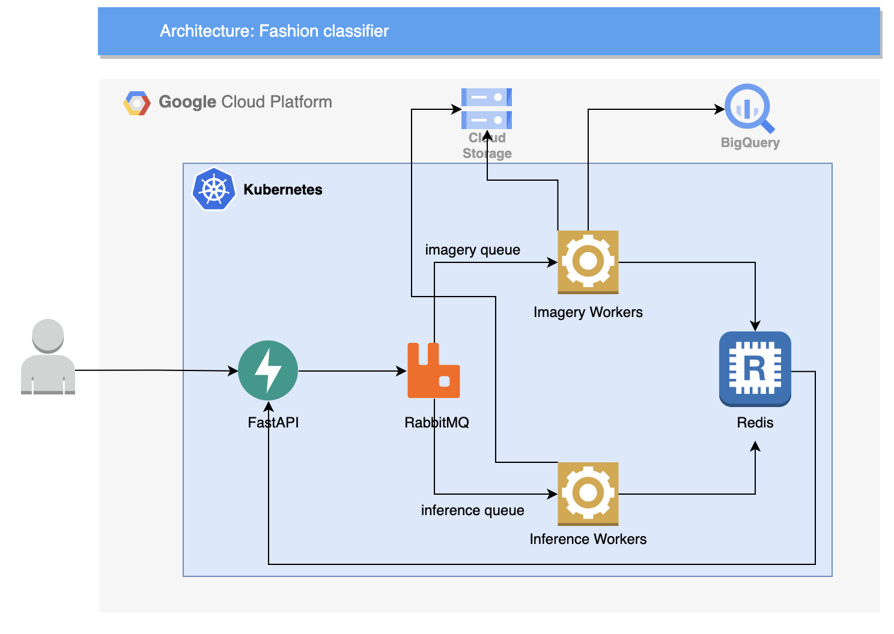

# Overview

This project is a scalable generic solution to deploy a fashion images classifier to meet e-commerce platform, and marketplace scenarios.

# Architecture



# Project Description

## Tutorial

Link: <link>

## Kubernetes (k8s) Cluster

### Creating k8s clusters
```sh
gcloud config set project tcc-lucas-pierre
gcloud compute zones list | grep us-east1
gcloud config set compute/region us-east1
gcloud container clusters create tcc-cluster --project=tcc-lucas-pierre --region=us-east1 --num-nodes=2 --preemptible
gcloud container clusters get-credentials tcc-cluster --region us-east1
```

### Removing k8s clusters
```sh
gcloud container clusters delete --region=us-east1 tcc-cluster
```

## AppEngine & Cloud Task queues
### Deploying AppEngine services & creating Cloud Task Queues
```sh
cd src/tasks/imagery
gcloud app deploy
gcloud tasks queues create imagery
```

```sh
cd src/tasks/inference
gcloud app deploy
gcloud tasks queues create inference
```
## Deploying & Executing

You should create your own Google Cloud account, then you should upload Docker images to your GCP Container Registry.

Authenticate to your GCP account Container Registry
```sh
gcloud services enable containerregistry.googleapis.com
gcloud auth login
```

Build and push your images:
```sh
docker-compose build --pull
docker-compose push
```

Then you can add files from `k8s` folder to your GCP editor file system, and execute them with this command line:
```sh
kubectl apply -f api-deployment.yaml,api-service.yaml,network-networkpolicy.yaml,variables-env-configmap.yaml
```
This will create all the needed Kubernetes deployments and services to reproduce the same steps you executed locally in Google Cloud.

You can get the external IP to access the client notebook with this command:
```sh
kubectl get services | grep client
```
Then you can access <EXTERNAL-IP:PORT> in your browser and you're ready to execute the same tasks you executed locally but this time in Google Cloud.

### Debugging
```sh
gcloud app logs tail -s imagery
gcloud app logs tail -s inference
```

## Run locally

* This project needs docker >= 20 and docker-compose >= 1.29.
* Make sure you have your JSON file with Google Application Credentials in the path `./src/mnt/credentials.json`

### Build

```sh
make build
```

### Set up

```sh
make up
```

After running this command you will see and URL for Jupyter notebook in the output. If not, you can run `docker-compose logs client` to find it out.

### Tear down

```sh
make down
```

### Tasks

Open the notebook in the url outputted by the `make up` command. In the notebook you will see a mocked client for the image classifier app.

1. When you make a call to the running classifier app it will filter **BigQuery** to fetch the image ids that match attributes on the payload and store those images with a specific bucket prefix on **Google Cloud Storage**. 
2. Augmentation can be performed based on augmentation config also present on the request payload
3. Run model inference on query results from Step 1 or Step 2

# Possible improvements

* Kubernetes also comes up as a good solution with integration with open-source projects like [Argo Workflows](https://argoproj.github.io/argo-workflows/) and [Kubeflow](https://www.kubeflow.org/). This projects are dedicated to manage deployment of ML workflows with simplicity, portability, parallelism and cost-effectiveness.
We didn't integrate these projects here because of the non-inclusion of enough resources in Google Cloud free tier. But when extending to the paying version, this would be a very useful improvement to benefit from **Kubeflow Pipeline** for scheduling and monitoring job/etl executions, as well as for experiment tracking.
* Use GPU resources to reduce inference time
* Monitoring/Validating results and model being deprecated in accuracy
* Use FastAPI documentation (Swagger)
* API Security 