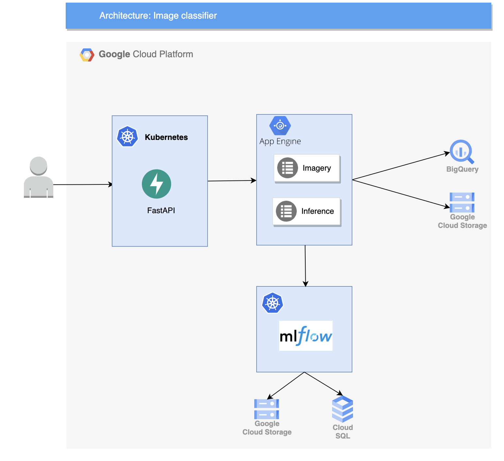

# Overview

This project is a scalable generic solution to deploy a fashion images classifier to meet e-commerce platform, and marketplace scenarios.

# Architecture



# Project instructions

## Prerequesites

This project needs docker >= 20 and docker-compose >= 1.29. Installation:

## Execute the project locally

### Build

```sh
make build
```

### Run

```sh
make up
```

After running this command you will see and URL for Jupyter notebook in the output. If not, you can run `docker-compose logs client` to find it out.

### Test

```sh
make test
```

### Finish

```sh
make down
```

### Tasks

Open the notebook in the url outputted by the `make up` command. In the notebook you will see three different tasks.

1. Implement functionality to upload images based on a sql query to **Cloud Storage**
2. Add augmentation to the Step 1
3. Run model inference on query results from Step 1 or Step 2

## Execute the project on Kubernetes

You should create your own Google Cloud account, then you should upload Docker images to your GCP Container Registry.

Authenticate to your GCP account Container Registry
```sh
gcloud services enable containerregistry.googleapis.com
gcloud auth login
```

Build and push your images:
```sh
docker-compose build --pull
docker-compose push
```

Then you can add files from `kubectl-files` folder to your GCP editor file system, and execute them with this command line:
```sh
kubectl apply -f api-deployment.yaml,api-service.yaml,backend-deployment.yaml,backend-service.yaml,broker-deployment.yaml,broker-service.yaml,client-claim0-persistentvolumeclaim.yaml,client-deployment.yaml,client-service.yaml,database-claim0-persistentvolumeclaim.yaml,database-deployment.yaml,database-service.yaml,imagery-worker-deployment.yaml,inference-worker-deployment.yaml,network-networkpolicy.yaml,variables-env-configmap.yaml
```
This will create all the needed Kubernetes deployments and services to reproduce the same steps you executed locally in Google Cloud.

You can get the external IP to access the client notebook with this command:
```sh
kubectl get services | grep client
```
Then you can access <EXTERNAL-IP:PORT> in your browser and you're ready to execute the same tasks you executed locally but this time in Google Cloud.


# Possible improvements

Kubernetes also comes up as a good solution with integration with open-source projects like [Argo Workflows](https://argoproj.github.io/argo-workflows/) and [Kubeflow](https://www.kubeflow.org/). This projects are dedicated to manage deployment of ML workflows with simplicity, portability, parallelism and cost-effectiveness.
We didn't integrate these projects here because of the non-inclusion of enough resources in Google Cloud free tier. But when extending to the paying version, this would be a very useful improvement to benefit from **Kubeflow Pipeline** for scheduling and monitoring job/etl executions, as well as for experiment tracking.